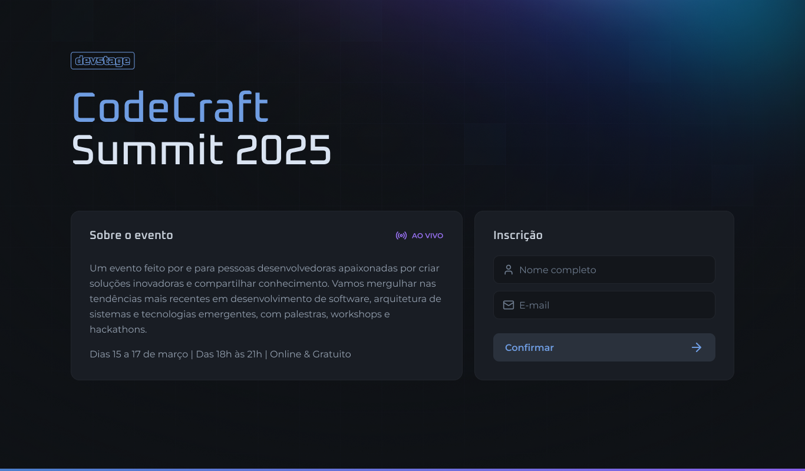
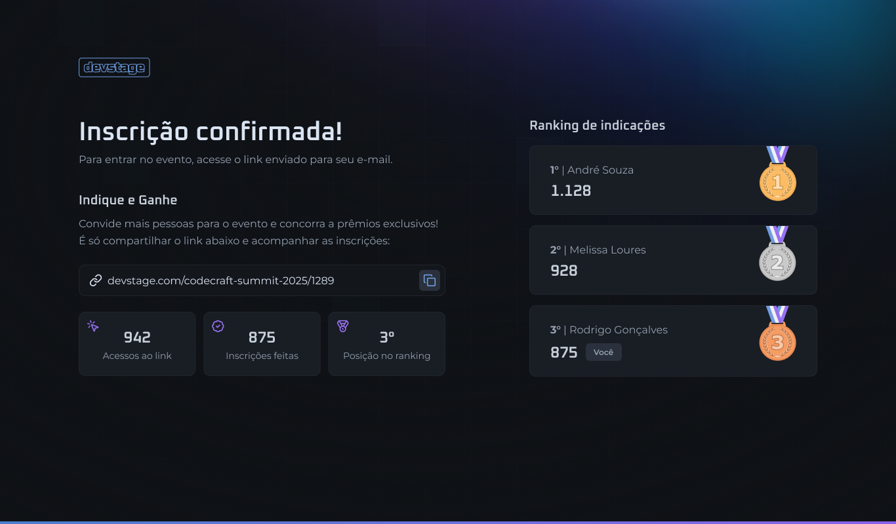
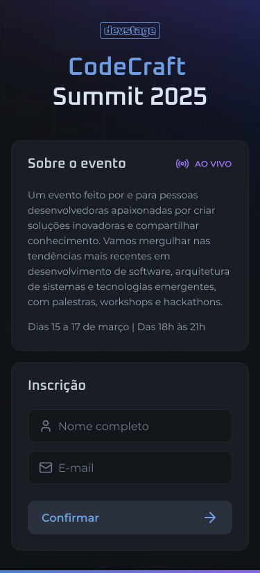
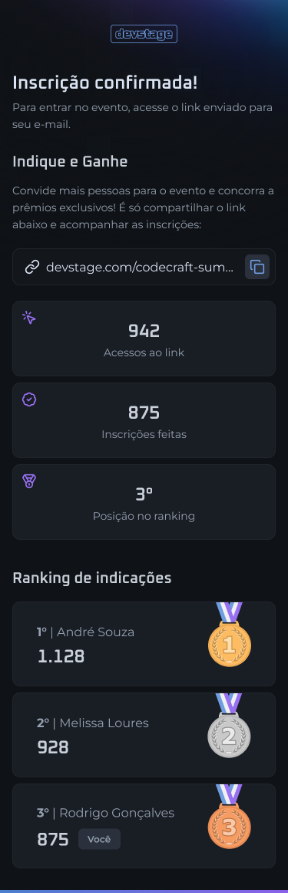

# CodeCraft Summit 2025 - NLW Connect - Nextjs


A aplicação é focada em facilitar a inscrição no CodeCraft Summit 2025, com um design moderno e funcionalidades extras como programa de indicação e gamificação. Esse projeto foi desenvolvido atrevés do NLW Pocket oferecido pela [Rocketseat](https://github.com/rocketseat-education).

## Screenshots

<div style="text-align: center;">
  
</div>

<div style="text-align: center;">
  
</div>

<div style="text-align: center;">

 />


</div>

<div style="text-align: center;">
 
</div>

## Tecnologias Utilizadas

- **Next.js** - Framework para React com renderização híbrida e otimização de desempenho.
- **TypeScript** - Superset tipado do JavaScript para um código mais seguro e escalável.
- **React Hook Form** - Gerenciamento eficiente de formulários em React.
- **Zod** - Validação e tipagem de dados de entrada.
- **TailwindCSS** - Biblioteca para estilização baseada em utilitários.
- **Axios** - Cliente HTTP para interação com a API.

## Repositório do Backend

O backend do projeto está disponível em:
[Ticket Hub - Backend](https://github.com/rocketseat-education/nlw-connect-node)

## Como Rodar o Projeto

### Requisitos

- Node.js 20+
- pnpm(de preferência),npm ou yarn

### Instalação

1. Clone este repositório:

   ```bash
   git clone https://github.com/ismael-henrique-dev/Nlw-Connect-Nextjs.git
   cd nlw-connect
   ```

2. Instale as dependências:

   ```bash
   pnpm install
   # ou
   yarn install
   ```

3. Execute o projeto em ambiente de desenvolvimento:

   ```bash
   pnpm dev
   # ou
   npm run dev
   # ou
   yarn dev
   ```

4. O projeto estará disponível em: [http://localhost:3000](http://localhost:3000)

## Estrutura do Projeto

A estrutura do projeto segue uma organização modularizada:

```
/ticket-hub
├── .next              # Build do Next.js
├── node_modules       # Dependências do projeto
├── public             # Arquivos estáticos
├── src
│   ├── app           # Rotas e páginas do Next.js
│   ├── assets        # Arquivos de mídia
│   ├── components    # Componentes reutilizáveis
│   
├── .gitignore        # Arquivos ignorados pelo Git
├── next-env.d.ts     # Definições do ambiente Next.js
├── next.config.ts    # Configurações do Next.js
├── package.json      # Dependências e scripts do projeto
├── tsconfig.json     # Configuração do TypeScript
├── postcss.config.mjs# Configuração do PostCSS
└── README.md         # Documentação do projeto
```

## Aprendizados

Durante o desenvolvimento do **NLW Connect**, aprendi e apliquei conceitos importantes:

- **Gerenciamento de formulários** com React Hook Form e validação com Zod.
- **Estilização eficiente** com TailwindCSS V4 e novas features do mesmo.
- **Gerenciamento de estado e requisições** usando Axios.
- **Melhores práticas de tipagem** no TypeScript para um código mais robusto.
- **Organização do Next.js**, utilizando `app` directory para um código modular.

## Funcionalidades

- **Criar incrinção no evento** – Simulação do processo de incrição ao evento.
- **Ver ranking** – Possibilidade de ver as quantias de pessoas que compartilharam seu link.

---

Caso tenha dúvidas ou sugestões, sinta-se à vontade para abrir uma issue ou entrar em contato.
